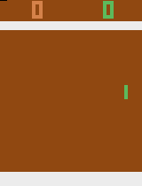
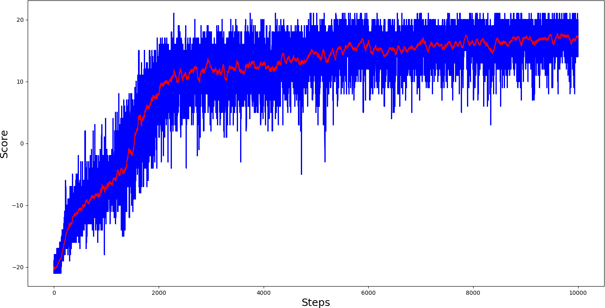

# Reinforcement Learning Tutorials:

*2020-10-07 added support for Tensorflow 2.3.1*

PPO and PPO_CNN agents playing Pong-v0 game: 

*2020-10-10 added LunarLander-v2_PPO Continuous code for Tensorflow 2.3.1*:

*2020-10-23 added BipedalWalker-v3_PPO code for Tensorflow 2.3.1*:

1. [Deep Q Learning tutorial (DQN)](https://pylessons.com/CartPole-reinforcement-learning/)

2. [Double Deep Q Learning tutorial (DDQN)](https://pylessons.com/CartPole-DDQN/)

3. [Dueling Double Deep Q Learning tutorial (D3QN)](https://pylessons.com/CartPole-DDDQN/)

4. [Epsilon Greedy Dueling Double Deep Q Learning tutorial (D3QN)](https://pylessons.com/Epsilon-Greedy-DQN/)

5. [Prioritized Experience Replay (PER) D3QN tutorial](https://pylessons.com/CartPole-PER/)

6. [D3QN PER with Convolutional Neural Networks tutorial](https://pylessons.com/CartPole-PER-CNN/)

7. [A.I. learns to play Pong with DQN](https://pylessons.com/DQN-PONG/)

8. [Introduction to RL Policy Gradient (PG or REINFORCE)](https://pylessons.com/Beyond-DQN/)

9. [Introduction to RL Advanced Actor Critic algorythm (A2C)](https://pylessons.com/A2C-reinforcement-learning/)

10. [Introduction to RL Asynchronous Advanced Actor Critic algorythm (A3C)](https://pylessons.com/A3C-reinforcement-learning/)

11. [Introduction to RL Proximal Policy Optimization algorythm (PPO)](https://pylessons.com/PPO-reinforcement-learning/)

12. [Let’s code from scratch a discrete Reinforcement Learning rocket landing agent! (PPO)](https://pylessons.com/LunarLander-v2-PPO/)

13. [Continuous Proximal Policy Optimization Tutorial with OpenAI gym environment! (PPO)](https://pylessons.com/BipedalWalker-v3-PPO/)
  
PPO Pong-v0 Learning curve:

